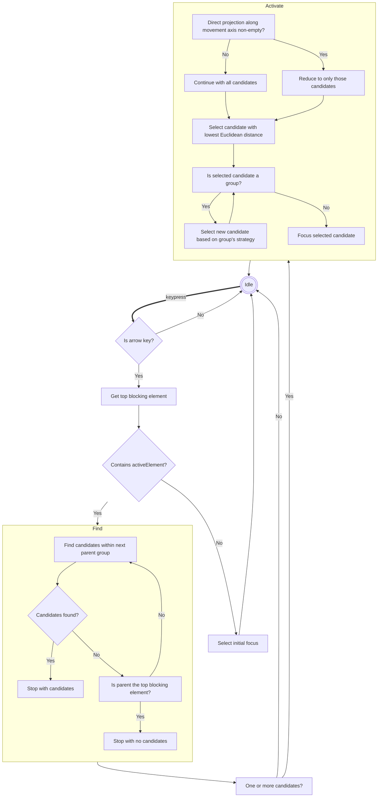

# focus-shift

focus-shift is a lightweight, zero-dependency JavaScript library designed for keyboard-based navigation in web applications. It restricts itself to shifting focus between elements in response to arrow key events. The behaviour of focus shifting can be guided by annotations in the HTML markup. This allows the library to work well with technologies that prefer generating HTML over interacting with JavaScript directly.

## Features

- Move focus with the arrow keys
- Declare groups with custom focus strategies
- Mark subtrees of the DOM that should trap focus
- Mark subtrees of the DOM that should be skipped
- Dispatches events which allow canceling individual focus shifts

## Usage

Here's a simple example of annotating markup:

```html
<div data-focus-group="active">
  <button>Home</button>
  <button data-focus-active>About</button>
  <button>Contact</button>
</div>

<button data-focus-skip>Delete your account</button>

<script type="module" src="focus-shift.js"></script>
```

## Options

The following attributes may be added in the markup to guide the moving of focus:

- `data-focus-group`: Defines a navigation group and the initial focus when focus moves to a group. Default is `linear`.
  - `first`: The first element in the DOM order receives focus.
  - `last`: The last element in the DOM order is focused initially.
  - `active`: Focuses on the element within the group marked as active.
  - `linear`: Focus is determined by the spatial direction of user navigation.
  - `memorize`: The last focused element within the group receives focus again.
- `data-focus-active`: Marks an element as the currently active element within a group.
- `data-focus-skip`: Skips the element and its descendants in navigation.
- `data-focus-trap`: Only allows elements within the annotated layer to receive focus.

Setting `window.FOCUS_SHIFT_DEBUG = true` lets the library log processing steps to the browser's console.

## Principles and Scope

- **It doesn't just work.** It would be nice if focus could automatically move to the intuitive element in each case, but this seems to require a sophisticated model of visual weight and Gestalt principles. This is out of scope for a simple library like this.
- **It should be easy to make it work.** With a little bit of annotation in the markup, one can express relationships to help the algorithm move focus in an adequate way.
- **Annotations should be logical, not spatial.** To be useful in responsive layouts, the annotations should express logical rather than spatial relationships.
- **Keep state to a minimum.** As much as possible, the library should treat each event in isolation and not maintain state representing the page layout. This may make the library less performant, but avoids complicated and error prone recomputation logic.

### What the library doesn't do, but might

- Dispatch cancelable events when descending into or out of groups
- Treat elements in open shadow DOM as focusable
- Allow defining custom selectors for focusables
- Use focus heuristics based on user agent's [text direction](https://developer.mozilla.org/en-US/docs/Web/HTML/Global_attributes/dir)
- Offer a JavaScript API

### What the library probably shouldn't do

- Handle keyboard events other than arrow keys

### What the library can not do

- Handle focus in iframes or closed shadow DOM

### Mechanism



## Development

The library is implemented in [withered](https://en.wikipedia.org/wiki/Gunpei_Yokoi#Lateral_Thinking_with_Withered_Technology) JavaScript, so it should work directly with most browsers and a development server is not needed.

There is ample JSDoc documentation so that the TypeScript compiler may be used for typechecking in strict mode:

    npm test

The code is formatted with slightly non-standard prettier:

    npm run format

End-to-end tests are done using Cypress.

## Contributing

Contributions are welcome. Please fork the repository and submit a pull request with your proposed changes.

## Related Work and Inspiration

- https://github.com/bbc/lrud-spatial, a nice and simple but more spatially oriented library
- https://github.com/luke-chang/js-spatial-navigation, spatial navigation library with good functionality but JavaScript-focused and stateful configuration
- https://github.com/WICG/spatial-navigation, a possibly abandoned proposal for a Web Platform API

## License

(C) Copyright 2024 Dividat AG

Published under the MIT License. See [LICENSE](LICENSE) for details.
