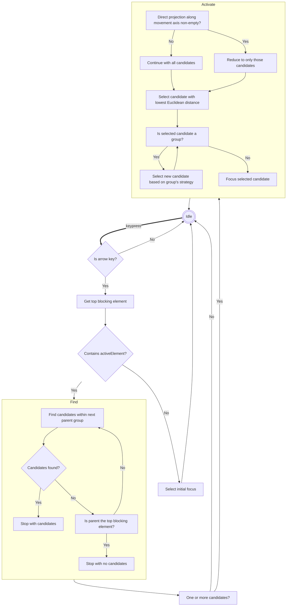

# focus-shift

## Introduction
focus-shift is a lightweight JavaScript library designed for keyboard-based navigation in web applications. It allows users to move focus between elements using the arrow keys. The behaviour of focus shifting can be guided by annotations in the HTML markup.

The library is kept simple and assumes use in kiosk-like interfaces.

## Features
- Move focus with arrow keys
- Declare groups with custom focus strategies
- Mark subtrees of the DOM as muted

## Usage
Include the library in your HTML file:
```html
<script src="focus-shift.js"></script>
```

### Basic Example
Here's a simple example of how to use the library:

```html
<div data-focus-group data-focus-group-select="active">
  <button>Home</button>
  <button data-focus-group-active>About</button>
  <button>Contact</button>
</div>
```

## Options

The following attributes may be added in the markup to guide the moving of focus"

- `data-focus-group`: Defines a navigation group.
- `data-focus-group-select`: Determines the initial focus when focus moves to a group.
  - `first`: The first element in the DOM order receives focus.
  - `last`: The last element in the DOM order is focused initially.
  - `active`: Focuses on the element within the group marked as active.
  - `linear`: Focus is determined by the spatial direction of user navigation.
- `data-focus-group-active`: Marks an element as the currently active element within a group.
- `data-focus-mute`: Skips the element and its descendants in navigation.
- `data-focus-solo`: Focuses within this element only, ignoring others in the same group.

## Limitations and simplifying assumptions
- **Arrow key navigation only**: The library listens only to arrow key events for navigation.
- **No iframe or ShadowDOM support**: Does not handle navigation within iframes or shadow DOM elements.
- **Viewport-filling applications without scrollbars**: Optimized for applications that fill the viewport without scrolling.
- **Exclusion of conflicting elements**: Avoids navigation to inputs like radio buttons to simplify navigation logic.

These limitations are intentional to keep the library simple and focused.

## Mechanism



## Contributing
Contributions are welcome. Please fork the repository and submit a pull request with your proposed changes.

## License
This project is licensed under the MIT License - see the [LICENSE.md](LICENSE) file for details.
